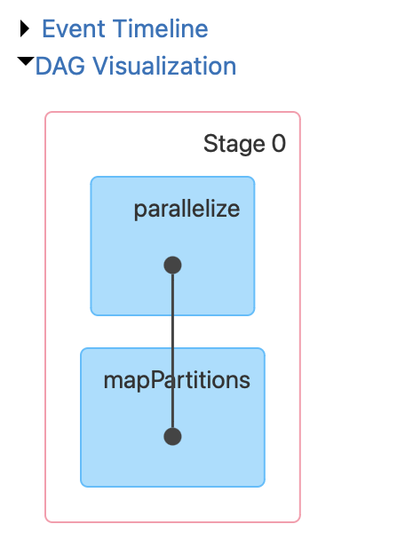

# Flight_Cancellation_Prediction

<div align="center">
  
</div>

## Table of Contents
- [Introduction](#introduction)
- [Dependencies](#dependencies)
- [Dataset](#dataset)
- [ETL Pipeline](#etl-pipeline)
- [Data Pre-Processing](#data-pre-processing)
- [Class Imbalance](#class-imbalance)
- [Classification Models](#classification-models)
- [Results](#results)
- [Future Scope](#future-scope)


## 1. Introduction

This GitHub repository hosts an end-to-end data science project that focuses on the analysis and prediction of flight status using binary classification techniques. The project comprises two main components:


  
-  #### ETL (Extract, Transform, Load) pipeline


Our ETL pipeline has been meticulously crafted to ingest, cleanse, and preprocess raw data, culminating in a refined dataset primed for in-depth analysis and the creation of purposeful reports.
  
The aim of this project is to perform binary classication into following classes:

- Flight is Cancelled (Positive class or 1)
- Fligh isn't Cancelled ( Negative class or 0)


Machine learning classifier: 

- ####  XGBoost
- #### Bernoullie Naive Base
- #### Random Forest

This study rigorously explores and contrasts the performance of three prominent classification models: XGBoost, Random Forest, and Bernoulli Naive Bayes. Our objective is to discern the model that excels in diverse contexts, thus enhancing the efficiency and accuracy of classification tasks.


This project's code is also available on Kaggle, where it was collaboratively developed by Khushal Sharma and Venkat Anand Sai Duggi. You can access and interact with the codes on Kaggle: <a href="https://www.kaggle.com/code/venkatanandsaid/airline-on-time-data-preprocessing">Data-Preprocessing</a>, <a href="https://www.kaggle.com/code/kms025/airline-on-time-classification">Classification-Task</a>


## 2. Dependencies

- Extracting Parquet data from Kaggle's API


```bash
from kaggle.api.kaggle_api_extended import KaggleApi
```


- Data Preprocessing

  
```bash
import os
import pandas as pd
from sklearn.preprocessing import LabelEncoder
```


- Machine Learning Operations


```bash
# Basic Libraries
import numpy as np
from tqdm import tqdm
from collections import Counter
from sklearn.model_selection import train_test_split

# Class Imbalance 
from imblearn.over_sampling import SMOTE

# Combining features for Visualization 
from sklearn.decomposition import PCA

# Visualization Purpose
import matplotlib.pyplot as plt
import seaborn as sns

# Classifiers
import xgboost as xgb
from sklearn.naive_bayes import BernoulliNB
from sklearn.ensemble import RandomForestClassifier

# Model Evaluation 
from sklearn.metrics import confusion_matrix
from sklearn.metrics import accuracy_score, classification_report
from sklearn.metrics import roc_curve, roc_auc_score
```


## 3. Dataset

- #### Dataset : Airline-on-time-performance-data,
- You can find the dataset <a href="https://www.kaggle.com/datasets/ahmedelsayedrashad/airline-on-time-performance-data/code?datasetId=3670668&sortBy=dateRun&tab=profile">here</a>
- The data consists of flight arrival and departure details for all commercial flights within the USA, from October 1987 to April 2008. This is a large dataset: there are nearly 120 million records in total and takes up 1.6 gigabytes of space when compressed and 12 gigabytes when uncompressed.
- In this project we used Data from year 2006,2007 and 2008, which is in **parquet format**.
  
- #### Features: There are 31 attributes shown in the following table

<table>
  <thead>
    <tr>
      <th>Name</th>
      <th>Description</th>
    </tr>
  </thead>
  <tbody>
    <tr>
      <td>year</td>
      <td>1987-2008</td>
    </tr>
    <tr>
      <td>month</td>
      <td>1-12</td>
    </tr>
    <tr>
      <td>day of month</td>
      <td>1-31</td>
    </tr>
    <tr>
      <td>day of week</td>
      <td>1 (Monday) - 7 (Sunday)</td>
    </tr>
    <tr>
      <td>DepTime</td>
      <td>actual departure time (minutes)</td>
    </tr>
    <tr>
      <td>CRSDepTime</td>
      <td>scheduled departure time (minutes)</td>
    </tr>
    <tr>
      <td>ArrTime</td>
      <td>actual arrival time (minutes)</td>
    </tr>
    <tr>
      <td>CRSArrTime</td>
      <td>scheduled arrival time (minutes)</td>
    </tr>
    <tr>
      <td>UniqueCarrier</td>
      <td>unique carrier code</td>
    </tr>
    <tr>
      <td>FlightNum</td>
      <td>flight number</td>
    </tr>
    <tr>
      <td>TailNum</td>
      <td>plane tail number</td>
    </tr>
    <tr>
      <td>ActualElapsedTime</td>
      <td>in minutes</td>
    </tr>
    <tr>
      <td>CRSElapsedTime</td>
      <td>in minutes</td>
    </tr>
    <tr>
      <td>AirTime</td>
      <td>in minutes</td>
    </tr>
    <tr>
      <td>ArrDelay</td>
      <td>arrival delay, in minutes</td>
    </tr>
    <tr>
      <td>DepDelay</td>
      <td>departure delay, in minutes</td>
    </tr>
    <tr>
      <td>Origin</td>
      <td>origin IATA airport code</td>
    </tr>
    <tr>
      <td>Dest</td>
      <td>destination IATA airport code</td>
    </tr>
    <tr>
      <td>Distance</td>
      <td>in miles</td>
    </tr>
    <tr>
      <td>TaxiIn</td>
      <td>taxi in time, in minutes</td>
    </tr>
    <tr>
      <td>TaxiOut</td>
      <td>taxi out time in minutes</td>
    </tr>
    <tr>
      <td>Cancelled</td>
      <td>was the flight cancelled?</td>
    </tr>
    <tr>
      <td>CancellationCode</td>
      <td>reason for cancellation (A = carrier, B = weather, C = NAS, D = security)</td>
    </tr>
    <tr>
      <td>Diverted</td>
      <td>1 = yes, 0 = no</td>
    </tr>
    <tr>
      <td>CarrierDelay</td>
      <td>in minutes</td>
    </tr>
    <tr>
      <td>WeatherDelay</td>
      <td>in minutes</td>
    </tr>
    <tr>
      <td>NASDelay</td>
      <td>in minutes</td>
    </tr>
    <tr>
      <td>SecurityDelay</td>
      <td>in minutes</td>
    </tr>
    <tr>
      <td>LateAircraftDelay</td>
      <td>in minutes</td>
    </tr>
  </tbody>
</table>

## 4. ETL Pipeline

Used **Azure Databricks** to build the pipeline, designed to efficiently ingest, process/transform , and prepare the data for Classification task.

**Data Ingestion:**
The pipeline initiates by ingesting the raw data in parquet format into Azure DBFS through the Command Line Interface (CLI). This data forms the foundation of our analysis and includes crucial information about flights, such as departure times, arrival times, delays, unique carriers, and more.


We then employ **two Spark jobs** to enrich the dataset with binary columns, simplifying subsequent analyses. These jobs (Azure Notebooks) were executed on a cluster/ compute deployed inside the Azure Workspace. Find more information regarding <a href="https://azure.microsoft.com/en-us/products/databricks#features">Azure-Databricks</a> 

- **Transformation 1** **: Adding binary columns**

The first Spark job adds binary columns for departure delays (0 or 1) and arrival delays (0 or 1). This transformation makes it easier to categorize flights based on whether they experienced delays or not. Further we partitioned the data into 20 parts. 

```bash
# Add new columns for arrival and departure delay indicators
df = df.withColumn("arrival_delay_indicator", when(col("arrival_delay") > 0, "yes").otherwise("no"))
df = df.withColumn("departure_delay_indicator", when(col("departure_delay") > 0, "yes").otherwise("no"))
```

<div align="center">
  
</div>

```bash
df = df.repartition(20)
```

- **Transformation 2** **: Group by unique carrier and month**

Second Spark job is to find insights to answer questions such as, when is the best time of day/day of week/time of year to fly to minimise delays? and which carrier causes the most delays?

   ```scala
   // SQL query to aggregate delays per unique carrier
   SELECT unique_carrier,
          SUM(CASE WHEN arrival_delay > 0 THEN 1 ELSE 0 END) AS arrival_delays,
          SUM(CASE WHEN departure_delay > 0 THEN 1 ELSE 0 END) AS departure_delays
   FROM flight_data
   GROUP BY unique_carrier
   ORDER BY unique_carrier
   ```

   ```scala
   // SQL query to aggregate delays per month
   SELECT month,
          SUM(CASE WHEN arrival_delay > 0 THEN 1 ELSE 0 END) AS arrival_delays,
          SUM(CASE WHEN departure_delay > 0 THEN 1 ELSE 0 END) AS departure_delays
   FROM flight_data
   GROUP BY month
   ORDER BY month
   ```

**Data Export and Classification:**
After transforming and summarizing the data, it is loaded back into Azure DBFS. From this point, you can proceed with classification tasks using machine learning models like XGBoost, Random Forest, or Bernoulli Naive Bayes to predict flight delays or other related outcomes.

This ETL pipeline effectively prepares the data and generates valuable insights, enabling data-driven decision-making in the airline industry. The combination of Azure DBFS and **Apache Spark** provides a scalable and efficient environment for handling and analyzing large datasets.


<h2> 5. Data Preprocessing</h2>

<p>As part of the data preprocessing phase, several important steps were undertaken to ensure the data was ready for analysis:</p>

<ol>
  <li><strong>Data Transformation:</strong> The raw data was transformed to include two new columns, namely <em>arrival-delay-indicator</em> and <em>departure-delay-indicator</em>, with '1' indicating a delay and '0' indicating no delay.</li>
  
  <li><strong>Data Partitioning:</strong> To achieve efficient data parallelism, the transformed dataset was partitioned into 20 CSV files. This partitioning allowed for the distribution of workload across multiple computing nodes and cores.</li>
  
  <li><strong>Merging Data:</strong> To facilitate further analysis, the partitioned data was merged into a single dataset, ensuring consolidated and accessible information.</li>
  
  <li><strong>Data Cleaning:</strong> Rows containing NaN values were removed, and unnecessary features were dropped from the dataset to enhance data quality.</li>
  
  <li><strong>Handling Class Imbalance:</strong> The dataset exhibited a significant class imbalance with Class 0 being the majority class and Class 1 as the minority class, resulting in a class imbalance ratio of approximately 49:1.</li>
</ol>

<p>To address the class imbalance problem, the Synthetic Minority Over-sampling Technique (SMOTE) algorithm was employed.</p>

<h3>About SMOTE Algorithm</h3>

<p>SMOTE, or Synthetic Minority Over-sampling Technique, is a resampling technique designed to address class imbalance in datasets. It works by generating synthetic examples for the minority class to balance the class distribution. This involves creating new instances that are combinations of existing minority class instances.</p>

<p>SMOTE helps prevent model bias towards the majority class and improves the predictive performance of machine learning models. It achieves this by increasing the representation of the minority class, thus ensuring that the model has sufficient examples to learn from for both classes.</p>

<p>By employing SMOTE, we aimed to create a more balanced and representative dataset, ultimately enhancing the accuracy and fairness of our machine learning models.</p>

<h3>Before and After SMOTE Visualization</h3>


<div align="center">
  
</div>


